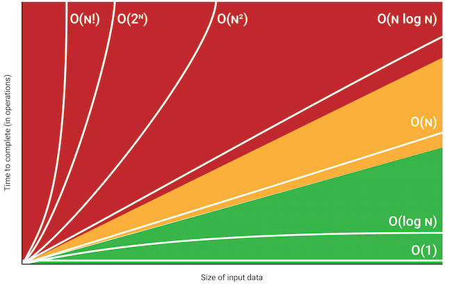

# Demonstrate different BigO notations

Big O notation is a way to describe the performance of an algorithm by analyzing the relationship between the input size (n) and the number of operations required. It provides an upper bound on the growth rate of an algorithm, allowing us to compare the efficiency of different algorithms.




Here's a Python example

```python
def constant_time(n):
    return n * 2

def linear_time(arr):
    for i in arr:
        print(i)

def quadratic_time(arr):
    for i in arr:
        for j in arr:
            print(i, j)

def logarithmic_time(n):
    while n > 1:
        n = n // 2
        print(n)
```

1. `constant_time`: **O(1)** - Constant Time
The function takes a single integer as input and returns the result of a simple arithmetic operation. The number of operations does not depend on the input size, so it's a constant time complexity.
2. `linear_time`: **O(n)** - Linear Time
The function takes a list as input and iterates through each element once. The number of operations is directly proportional to the input size, so it's a linear time complexity.
3. `quadratic_time`: **O(n^2)** - Quadratic Time
The function takes a list as input and iterates through each element using nested loops. The number of operations is proportional to the square of the input size, so it's a quadratic time complexity.
4. `logarithmic_time`: **O(log n)** - Logarithmic Time
The function takes an integer as input and repeatedly divides it by 2 until it reaches 1. The number of operations is proportional to the logarithm (base 2) of the input size, so it's a logarithmic time complexity.


